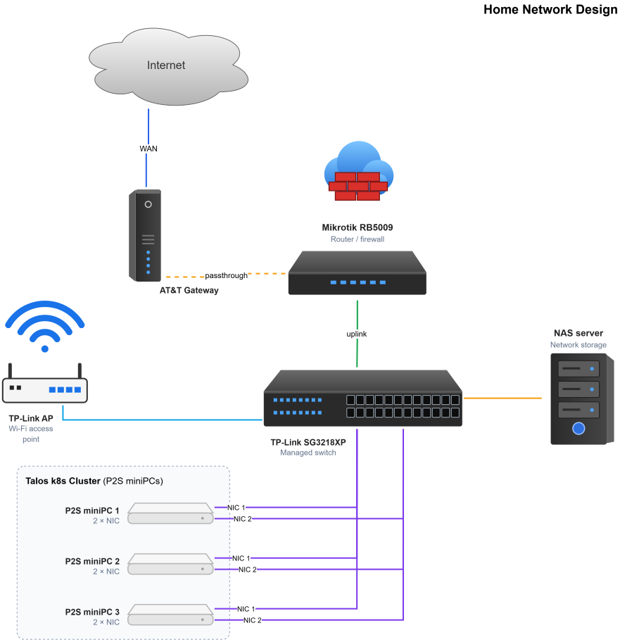

# 🏡 Home Infrastructure & GitOps Cluster

A declarative home-lab Kubernetes environment managed with GitOps.

---

## 🎯 Purpose

This repo is both my running infrastructure and my learning environment for running a production-style Kubernetes platform at home.

I use it to get hands-on with:

* Kubernetes administration and troubleshooting
* GitOps and declarative infrastructure
* Kubernetes networking and Gateway API
* Infrastructure automation
* Secret management and encryption
* Persistent storage and PostgreSQL
* Backup and disaster recovery
* Security and access control
* Running self-hosted apps

The point isn't just to have apps running. It's to actually understand what's happening underneath: how the pieces talk to each other, how to change infra without breaking it, and how to recover when something inevitably does break. Everything here aims to be declarative, reproducible, secure, and recoverable.

Infra, apps, and config all live in Git so changes can be reviewed, reproduced, and rolled back.

---

## 🧭 Architecture



### Gateway Routing



```text
┌─────────────────────────────────────┐
│            Applications             │
│  Vaultwarden · Firefly III · etc.   │
├─────────────────────────────────────┤
│          Traffic & Access           │
│  Gateway API · Traefik · Cilium     │
├─────────────────────────────────────┤
│          Infrastructure             │
│  Flux · cert-manager · CNPG · DNS   │
├─────────────────────────────────────┤
│          Kubernetes Platform        │
│             Talos Linux             │
└─────────────────────────────────────┘
```

Flux watches this repo (Git is the source of truth) and reconciles it against the cluster, applying infrastructure first, then apps.

Internal traffic goes through the Cilium Gateway. External traffic comes in over Cloudflare Tunnel and hits Traefik before reaching any Kubernetes services. Service IPs are advertised internally over BGP.

Secrets are encrypted using SOPS and age prior to commit, with Flux decrypting them at reconcile time. No plaintext secrets ever hit the repository. Gitleaks validates that no unencrypted secrets enter the repo before anything is committed.

---

## 🛠️ Technology Stack

### Kubernetes Platform

| Technology  | Role                                              |
| :---------- | :------------------------------------------------ |
| Talos Linux | Immutable, API-driven Kubernetes operating system |
| Kubernetes  | Container orchestration platform                  |
| FluxCD      | GitOps continuous delivery and reconciliation     |
| Kustomize   | Declarative Kubernetes configuration and overlays |

### Networking & Ingress

| Technology           | Role                                                      |
| :-------------------- | :--------------------------------------------------------- |
| Cilium                | CNI, eBPF networking, network policy, and BGP              |
| Cilium Gateway API    | Internal application gateway                               |
| Traefik               | External application gateway / ingress                     |
| Gateway API           | Kubernetes-native HTTP routing                              |
| Cloudflare Tunnel     | Secure external access without direct inbound exposure     |

### TLS & DNS

| Technology        | Role                                        |
| :----------------- | :------------------------------------------- |
| cert-manager       | Automated certificate issuance and renewal   |
| Let's Encrypt      | Public certificate authority                 |
| Cloudflare DNS     | DNS-01 challenge provider                    |
| ExternalDNS        | Automated DNS record management              |
| Technitium DNS     | Internal / split-horizon DNS                 |

### Storage

| Technology               | Role                                |
| :------------------------ | :------------------------------------ |
| NAS (NFS)                 | Primary network storage             |
| NFS Client Provisioner    | Dynamic Kubernetes PV provisioning  |
| Local Path Provisioner    | Node-local persistent storage       |
| Backblaze B2              | Off-site object storage for backups |
| Longhorn                  | Dynamic Kubernetes PV provisioning P2 Cluster |

### Databases & Disaster Recovery

| Technology            | Role                                |
| :--------------------- | :------------------------------------ |
| PostgreSQL             | Application database                |
| CloudNativePG          | Kubernetes PostgreSQL operator      |
| Barman Cloud Plugin    | PostgreSQL backup to object storage |
| Backblaze B2           | Off-site PostgreSQL backup storage  |

Postgres workloads get backed up to Backblaze B2, and I test restores using the manifests under `k8s-test/`.

### Applications

| Application       | Purpose                       |
| :----------------- | :------------------------------ |
| Vaultwarden        | Self-hosted password manager  |
| Firefly III        | Personal finance management   |
| Linkding           | Self-hosted bookmark manager  |

---

## 📂 Repository Structure

```text
.
├── README.md
├── apps
│   ├── base            # cloudflare-tunnel, firefly, linkding, vaultwarden manifests
│   ├── migration
│   └── production      # cloudflare-tunnel, firefly, vaultwarden overlays
├── clusters
│   ├── migration        # Flux entrypoints: apps.yaml, infrastructure.yaml, flux-system
│   └── production       # Flux entrypoints: apps.yaml, infrastructure.yaml, flux-system
├── infrastructure
│   ├── configs/base      # cert-manager, cilium-gateway, traefik
│   ├── controllers
│   │   ├── addons        # local-path-provisioner, longhorn
│   │   └── base           # cert-manager, cnpg, external-dns, nfs-client, traefik
│   ├── crds/gateway-api
│   ├── migration          # config/controller overlays for the migration cluster
│   ├── production          # config/controller overlays for the production cluster
│   └── secrets
│       ├── migration
│       └── production
├── docs                    # runbooks & troubleshooting guides
└── k8s-test
```

---

## 📚 Documentation

Runbooks and troubleshooting notes (Talos rebuilds, Cilium Gateway, Cloudflare Tunnel/Traefik, Postgres restores, storage and network testing) are under [`docs/`](docs/).
